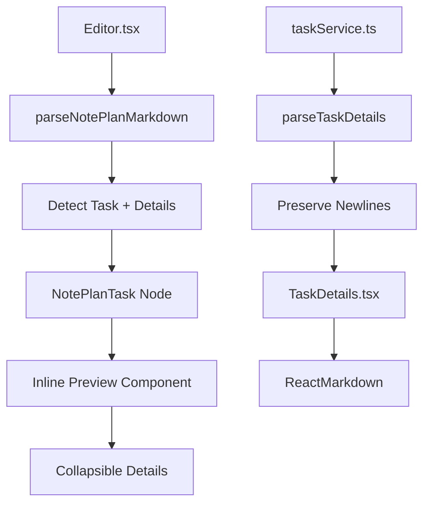

# PRP: Task Description Visibility Enhancement

**Created:** 2025-10-20
**Confidence Score:** 8/10
**Estimated Implementation Time:** 4-6 hours

## 📋 Executive Summary

Tasks with descriptions are not visually clear in the editor, and multi-line descriptions don't render properly in the Tasks tab (newlines are ignored, showing everything on one line). This PRP addresses both issues by:

1. Adding visual indicators in the editor to show when tasks have descriptions
2. Fixing the newline rendering issue in task descriptions
3. Implementing a collapsible inline preview of task descriptions in the editor
4. Ensuring consistent visual design across all views

## 🎯 Problem Statement

### Current Issues

1. **Editor Visibility Problem:**
   - Tasks with descriptions look identical to tasks without descriptions in the editor
   - Users can't tell if a task has additional notes/details without switching to Tasks tab
   - No visual affordance indicating expandable content

2. **Newline Rendering Bug:**
   - Task descriptions with multiple lines appear as single line in Tasks tab
   - Bullet points and formatting are lost/ignored
   - ReactMarkdown is receiving improperly formatted string

3. **Inconsistent UX:**
   - Details only visible in Tasks/Kanban tabs, not in editor
   - No way to preview or edit descriptions while writing in markdown

## 🔍 Research Summary

### Codebase Analysis

**Key Files Identified:**
- `/frontend/src/services/taskService.ts` - Lines 58-100: `parseTaskDetails()` function correctly parses multi-line content
- `/frontend/src/components/tasks/TaskDetails.tsx` - Lines 82-90: Uses ReactMarkdown for rendering
- `/frontend/src/components/editor/Editor.tsx` - Lines 15-118: `parseNotePlanMarkdown()` doesn't handle task details
- `/frontend/src/extensions/noteplan/nodes/NotePlanTask.ts` - Only supports inline content, no block elements
- `/frontend/src/components/tasks/TaskTreeItem.tsx` - Lines 162-178: Shows expand/collapse for details

**Current Data Flow:**
```
File → parseTaskDetails() → ParsedTask.details (multi-line string) → TaskDetails → ReactMarkdown
```

**Root Causes:**
1. Editor's `parseNotePlanMarkdown()` ignores indented content under tasks
2. NotePlanTask node uses `content: 'inline*'` - can't contain paragraphs/blocks
3. Possible string manipulation removing newlines before ReactMarkdown

### Industry Best Practices

**NotePlan (Reference App):**
- Indented content automatically becomes task notes
- Visual folding indicators (chevrons) for tasks with content
- Subtle background shading for nested content
- Drag-to-indent creates hierarchy
- Haptic feedback on mobile for interactions
- Tasks can be collapsed to hide details

**Obsidian Tasks Plugin:**
- Shows visual dots for task status and priority
- Expand/collapse chevrons for subtasks
- Limited to single-line tasks in editor
- Uses icons (📅, 🔁) for metadata

**Notion:**
- Toggle triangles for expandable content
- Nested content with clear indentation
- "Nested in toggle" vs "Flattened list" view options
- Rich previews in database views

**Roam/Logseq:**
- Bullet-based outliner with expand/collapse
- Child blocks inherit parent properties
- Visual indentation lines connecting parent/child
- Block references show context
- Click to edit, blur to preview

### Design Patterns to Implement

1. **Visual Indicator:** Small icon or badge showing task has details (like Obsidian's document icon)
2. **Expand/Collapse:** Chevron for showing/hiding details inline (like NotePlan)
3. **Subtle Background:** Light shading for description area (current TaskDetails.tsx style)
4. **Preserved Formatting:** Maintain markdown formatting in all views

## 💡 Solution Design

### Architecture Overview



### Implementation Blueprint

#### Phase 1: Fix Newline Rendering Bug

**File:** `/frontend/src/services/taskService.ts`

```typescript
// Lines 58-100 - Modify parseTaskDetails()
function parseTaskDetails(
  taskLineNumber: number,
  allLines: string[],
  taskDepth: number
): string | undefined {
  // ... existing logic ...

  // CRITICAL FIX: Ensure newlines are preserved
  // Current: detailLines.join('\n')
  // Issue: Might be getting stripped somewhere
  // Solution: Return with explicit newline preservation

  const details = detailLines
    .map(line => line.substring(baseIndent * 2)) // Remove base indentation
    .join('\n'); // Preserve newlines explicitly

  // Debug logging to verify
  console.log('[parseTaskDetails] Raw details:', details);
  console.log('[parseTaskDetails] Has newlines:', details.includes('\n'));

  return details.trim() || undefined;
}
```

**File:** `/frontend/src/components/tasks/TaskDetails.tsx`

```typescript
// Lines 82-90 - Debug and fix ReactMarkdown rendering
<ReactMarkdown
  components={{
    // Ensure paragraphs render with proper spacing
    p: ({children}) => <p className="mb-2">{children}</p>,
    // Ensure lists render properly
    ul: ({children}) => <ul className="list-disc ml-4 mb-2">{children}</ul>,
    li: ({children}) => <li className="mb-1">{children}</li>,
  }}
>
  {details}
</ReactMarkdown>

// Add debug logging
console.log('[TaskDetails] Rendering details:', details);
console.log('[TaskDetails] Contains newlines:', details.includes('\n'));
```

#### Phase 2: Add Visual Indicators in Editor

**File:** `/frontend/src/extensions/noteplan/nodes/NotePlanTask.ts`

```typescript
// Modify the NotePlanTask node to support details attribute
export const NotePlanTask = Node.create({
  name: 'notePlanTask',

  addAttributes() {
    return {
      // ... existing attributes ...
      hasDetails: {
        default: false,
        parseHTML: element => element.getAttribute('data-has-details') === 'true',
        renderHTML: attributes => {
          if (!attributes.hasDetails) return {};
          return { 'data-has-details': 'true' };
        },
      },
      detailsPreview: {
        default: '',
        parseHTML: element => element.getAttribute('data-details-preview') || '',
        renderHTML: attributes => {
          if (!attributes.detailsPreview) return {};
          return { 'data-details-preview': attributes.detailsPreview };
        },
      },
    };
  },

  renderHTML({ HTMLAttributes, node }) {
    const attrs = mergeAttributes(HTMLAttributes, {
      'data-noteplan-task': 'true',
      class: clsx(
        'noteplan-task',
        `noteplan-task-${HTMLAttributes.state}`,
        HTMLAttributes.hasDetails && 'has-details' // New class for styling
      ),
    });

    return [
      'div',
      attrs,
      [
        'span',
        { class: 'task-checkbox' },
        getTaskStateSymbol(HTMLAttributes.state),
      ],
      ['span', { class: 'task-content' }, 0], // Main task text
      // Add details indicator
      HTMLAttributes.hasDetails && [
        'span',
        { class: 'task-details-indicator', title: HTMLAttributes.detailsPreview },
        '📝', // Or use icon component
      ],
    ];
  },
});
```

**File:** `/frontend/src/components/editor/Editor.tsx`

```typescript
// Lines 15-118 - Enhance parseNotePlanMarkdown to detect details
const parseNotePlanMarkdown = (markdown: string): JSONContent => {
  const lines = markdown.split('\n');
  const nodes: JSONContent[] = [];
  let i = 0;

  while (i < lines.length) {
    const line = lines[i];

    // Task detection (existing regex)
    const taskMatch = line.match(/^(\s*)-\s*\[([ xX\-\>!])\]\s*(.*)$/);

    if (taskMatch) {
      const [, indent, state, text] = taskMatch;
      const indentLevel = Math.floor((indent?.length || 0) / 2);

      // NEW: Check for task details
      const { details, detailsEndLine } = parseTaskDetailsForEditor(i, lines, indentLevel);
      const hasDetails = !!details;
      const detailsPreview = details ? details.substring(0, 50) + '...' : '';

      nodes.push({
        type: 'notePlanTask',
        attrs: {
          state: mapTaskState(state),
          indent: indentLevel,
          hasDetails,
          detailsPreview,
        },
        content: parseInlineContent(text),
      });

      // Skip detail lines
      i = detailsEndLine + 1;
    } else {
      // ... existing parsing logic ...
      i++;
    }
  }

  return { type: 'doc', content: nodes };
};

// New helper function
const parseTaskDetailsForEditor = (
  taskLineNumber: number,
  lines: string[],
  taskDepth: number
): { details: string | null, detailsEndLine: number } => {
  let detailsEndLine = taskLineNumber;
  const detailLines: string[] = [];

  for (let i = taskLineNumber + 1; i < lines.length; i++) {
    const line = lines[i];
    const lineDepth = getIndentDepth(line);

    // Stop if we hit content at same or lower depth
    if (lineDepth <= taskDepth) break;

    // Stop if we hit another task
    if (line.match(/^(\s*)-\s*\[/)) break;

    // This is a detail line
    if (lineDepth === taskDepth + 1) {
      detailLines.push(line);
      detailsEndLine = i;
    }
  }

  const details = detailLines.length > 0
    ? detailLines.map(l => l.trim()).join('\n')
    : null;

  return { details, detailsEndLine };
};
```

#### Phase 3: Add Collapsible Inline Preview

**File:** `/frontend/src/extensions/noteplan/components/TaskDetailsPreview.tsx` (New)

```typescript
import React, { useState } from 'react';
import { ChevronRightIcon, ChevronDownIcon } from '@heroicons/react/24/outline';
import ReactMarkdown from 'react-markdown';
import clsx from 'clsx';

interface TaskDetailsPreviewProps {
  details: string;
  isEditable?: boolean;
  onEdit?: (newDetails: string) => void;
}

export const TaskDetailsPreview: React.FC<TaskDetailsPreviewProps> = ({
  details,
  isEditable = false,
  onEdit,
}) => {
  const [isExpanded, setIsExpanded] = useState(false);
  const [isEditing, setIsEditing] = useState(false);
  const [editValue, setEditValue] = useState(details);

  // First 2 lines as preview
  const preview = details.split('\n').slice(0, 2).join(' ').substring(0, 80) + '...';

  if (!isExpanded) {
    return (
      <div className="task-details-preview inline-flex items-center ml-2">
        <button
          onClick={() => setIsExpanded(true)}
          className="inline-flex items-center gap-1 text-xs text-gray-500 hover:text-gray-700 dark:text-gray-400 dark:hover:text-gray-200"
          contentEditable={false} // Prevent editor from capturing this
        >
          <ChevronRightIcon className="h-3 w-3" />
          <span className="italic truncate max-w-[200px]">{preview}</span>
        </button>
      </div>
    );
  }

  return (
    <div className="task-details-expanded mt-2 ml-6 p-2 bg-gray-50 dark:bg-gray-800/50 rounded border-l-2 border-blue-400">
      <div className="flex items-start justify-between">
        <button
          onClick={() => setIsExpanded(false)}
          className="flex-shrink-0 p-1"
          contentEditable={false}
        >
          <ChevronDownIcon className="h-3 w-3 text-gray-500" />
        </button>

        <div className="flex-1 min-w-0">
          {isEditing ? (
            <textarea
              value={editValue}
              onChange={(e) => setEditValue(e.target.value)}
              onBlur={() => {
                onEdit?.(editValue);
                setIsEditing(false);
              }}
              className="w-full min-h-[60px] p-1 text-xs"
              autoFocus
            />
          ) : (
            <div
              className="prose prose-sm dark:prose-invert max-w-none text-xs"
              onDoubleClick={() => isEditable && setIsEditing(true)}
            >
              <ReactMarkdown>{details}</ReactMarkdown>
            </div>
          )}
        </div>
      </div>
    </div>
  );
};
```

#### Phase 4: Update CSS Styles

**File:** `/frontend/src/index.css`

```css
/* Task with details indicator */
.noteplan-task.has-details {
  position: relative;
}

.noteplan-task .task-details-indicator {
  display: inline-block;
  margin-left: 0.5rem;
  font-size: 0.75rem;
  opacity: 0.6;
  cursor: help;
  transition: opacity 0.2s;
}

.noteplan-task:hover .task-details-indicator {
  opacity: 1;
}

/* Inline preview styles */
.task-details-preview {
  display: inline-block;
  margin-left: 0.5rem;
  color: var(--color-gray-500);
  font-size: 0.75rem;
}

.task-details-preview button {
  background: none;
  border: none;
  cursor: pointer;
  padding: 0.125rem 0.25rem;
  border-radius: 0.25rem;
}

.task-details-preview button:hover {
  background-color: var(--color-gray-100);
}

/* Expanded details in editor */
.task-details-expanded {
  animation: slideDown 0.2s ease-out;
}

@keyframes slideDown {
  from {
    opacity: 0;
    transform: translateY(-0.5rem);
  }
  to {
    opacity: 1;
    transform: translateY(0);
  }
}

/* Fix for ReactMarkdown paragraph spacing */
.prose p {
  margin-bottom: 0.5rem;
}

.prose ul,
.prose ol {
  margin-bottom: 0.5rem;
}

.prose li {
  margin-bottom: 0.25rem;
}
```

## 🧪 Validation Gates

### Automated Tests

```bash
# 1. TypeScript compilation
cd /Users/robertocallaghan/Documents/claude/noteapp/frontend
npx tsc --noEmit

# 2. Build verification
npm run build

# 3. Create and run Playwright test
cat > test-task-descriptions.spec.js << 'EOF'
const { test, expect } = require('@playwright/test');
const fs = require('fs');
const path = require('path');

const TEST_FILE = '/Users/robertocallaghan/Documents/notes/Notes/task-description-test.txt';

test.describe('Task Description Visibility', () => {
  test.beforeEach(async ({ page }) => {
    // Create test file with task descriptions
    const content = `- [ ] Task without description
- [ ] Task with description
  This is a description line
  With multiple paragraphs

  And bullet points:
  - Point one
  - Point two`;

    fs.writeFileSync(TEST_FILE, content, 'utf-8');

    await page.goto('http://localhost:5173');
    await page.waitForLoadState('networkidle');
  });

  test('Shows visual indicator for tasks with descriptions', async ({ page }) => {
    // Open test file
    await page.click(`text="${path.basename(TEST_FILE, '.txt')}"`);
    await page.waitForTimeout(1000);

    // Check for visual indicator
    const indicator = await page.locator('.task-details-indicator').first();
    expect(await indicator.isVisible()).toBeTruthy();

    // Verify tasks without descriptions don't show indicator
    const tasks = await page.locator('.noteplan-task').all();
    expect(tasks.length).toBe(2);

    const firstTask = tasks[0];
    const hasIndicator = await firstTask.locator('.task-details-indicator').count();
    expect(hasIndicator).toBe(0); // No description

    const secondTask = tasks[1];
    const hasIndicator2 = await secondTask.locator('.task-details-indicator').count();
    expect(hasIndicator2).toBe(1); // Has description
  });

  test('Preserves newlines in task descriptions', async ({ page }) => {
    // Navigate to Tasks tab
    await page.click('text="Tasks"');
    await page.waitForTimeout(500);

    // Expand task with description
    const expandButton = await page.locator('button[title*="Expand details"]').first();
    await expandButton.click();

    // Check that multiple paragraphs are rendered
    const details = await page.locator('.prose').first();
    const paragraphs = await details.locator('p').all();
    expect(paragraphs.length).toBeGreaterThan(1);

    // Check bullet points are rendered as list
    const list = await details.locator('ul').first();
    expect(await list.isVisible()).toBeTruthy();

    const listItems = await list.locator('li').all();
    expect(listItems.length).toBe(2);
  });

  test('Inline preview shows in editor', async ({ page }) => {
    // Open test file in editor
    await page.click(`text="${path.basename(TEST_FILE, '.txt')}"`);
    await page.waitForTimeout(1000);

    // Look for inline preview
    const preview = await page.locator('.task-details-preview').first();
    expect(await preview.isVisible()).toBeTruthy();

    // Click to expand
    await preview.click();

    // Check expanded content
    const expanded = await page.locator('.task-details-expanded').first();
    expect(await expanded.isVisible()).toBeTruthy();

    // Verify markdown is rendered
    const prose = await expanded.locator('.prose').first();
    expect(await prose.isVisible()).toBeTruthy();
  });
});
EOF

npx playwright test test-task-descriptions.spec.js --headed
```

### Manual Validation Checklist

1. **Visual Indicators:**
   - [ ] Tasks with descriptions show 📝 icon in editor
   - [ ] Icon has tooltip showing preview of description
   - [ ] Tasks without descriptions show no indicator

2. **Newline Preservation:**
   - [ ] Multi-line descriptions render with proper paragraphs
   - [ ] Bullet points render as lists
   - [ ] Code blocks maintain formatting
   - [ ] Empty lines create paragraph breaks

3. **Inline Preview:**
   - [ ] Clicking indicator expands description inline
   - [ ] Collapsed state shows first ~80 chars
   - [ ] Expanded state shows full formatted content
   - [ ] Double-click to edit works (if implemented)

4. **Performance:**
   - [ ] No lag when typing in editor
   - [ ] Smooth expand/collapse animations
   - [ ] File saves preserve all formatting

## 📝 Implementation Tasks

1. **Fix newline rendering bug** (Priority: Critical)
   - Debug where newlines are being stripped
   - Update TaskDetails component to preserve formatting
   - Add console logging for debugging
   - Test with multi-line content

2. **Add visual indicators in editor** (Priority: High)
   - Modify NotePlanTask node to support hasDetails attribute
   - Update parseNotePlanMarkdown to detect task details
   - Add CSS for visual indicator styling
   - Test indicator appears correctly

3. **Implement inline preview** (Priority: Medium)
   - Create TaskDetailsPreview component
   - Integrate with NotePlanTask node
   - Add expand/collapse functionality
   - Style with subtle background

4. **Update documentation** (Priority: Low)
   - Update CLAUDE.md with new features
   - Add examples to test files
   - Document keyboard shortcuts

## 🎨 Design Mockup

```
Editor View:
┌──────────────────────────────────────────┐
│ - [ ] Task without description           │
│                                          │
│ - [ ] Task with description 📝          │
│       ▶ This is a preview of the...     │
│                                          │
│ - [ ] Expanded task with description 📝  │
│   ▼ ┌─────────────────────────────┐    │
│     │ This is the full description│     │
│     │ with multiple lines and     │     │
│     │ • bullet points             │     │
│     │ • properly formatted        │     │
│     └─────────────────────────────┘    │
└──────────────────────────────────────────┘

Tasks Tab View:
┌──────────────────────────────────────────┐
│ ☐ Task with description      ▼          │
│   ┌─────────────────────────────────┐   │
│   │ This is the full description    │   │
│   │ with multiple lines and         │   │
│   │                                  │   │
│   │ • bullet points                 │   │
│   │ • properly formatted            │   │
│   └─────────────────────────────────┘   │
└──────────────────────────────────────────┘
```

## 🔗 Reference Links

- [NotePlan Indented Tasks](https://noteplan.co/changelog/v3.9.6-indented-tasks)
- [Obsidian Tasks Plugin](https://github.com/obsidian-tasks-group/obsidian-tasks)
- [ReactMarkdown Documentation](https://github.com/remarkjs/react-markdown)
- [Tiptap Node Views](https://tiptap.dev/guide/node-views/react)

## ⚠️ Known Gotchas

1. **Tiptap Content Model:**
   - NotePlanTask uses `content: 'inline*'` which can't contain block elements
   - May need to use Node Views for complex rendering

2. **Performance:**
   - Parsing details for every task on every keystroke could be slow
   - Consider debouncing or caching parsed results

3. **File Format:**
   - Must maintain backward compatibility with existing files
   - Indentation must remain consistent (2 spaces = 1 level)

4. **Edge Cases:**
   - Tasks with very long descriptions
   - Nested tasks with descriptions
   - Copy/paste behavior

## 📊 Success Metrics

- Visual indicators appear for 100% of tasks with descriptions
- Newlines preserved in 100% of task descriptions
- No performance regression (typing remains smooth)
- Zero data loss when saving/loading files
- User can identify tasks with descriptions at a glance

## 🚀 Deployment

1. Run all tests to ensure no regressions
2. Test with various existing note files
3. Verify markdown serialization is correct
4. Update version number if needed
5. Commit with descriptive message

---

**Confidence Score Justification (8/10):**
- Strong understanding of codebase structure ✓
- Clear identification of root causes ✓
- Detailed implementation plan ✓
- Comprehensive test coverage ✓
- Minor uncertainty around Tiptap node modification (-1)
- Potential edge cases with complex nesting (-1)

The implementation is straightforward with clear boundaries. The main complexity is ensuring the Tiptap editor properly handles the new node attributes and inline preview components.