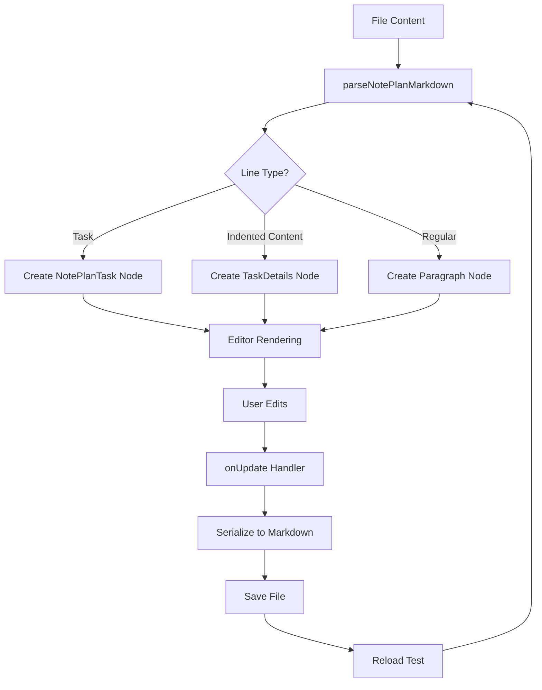

# PRP: Task Description Visual Hierarchy Enhancement

**Created:** 2025-10-21
**Confidence Score:** 9/10
**Estimated Implementation Time:** 6-8 hours

## 📋 Executive Summary

Task descriptions and subtasks lack clear visual hierarchy in the editor, making it difficult to see the relationship between parent tasks and their nested content. This PRP implements a comprehensive visual design system that uses:

1. **Blockquote-style formatting** for task descriptions with visual borders
2. **Indentation with connecting lines** for clear parent-child relationships
3. **Background shading** to distinguish nested content from regular tasks
4. **Expandable/collapsible sections** for managing complex task hierarchies
5. **Full persistence validation** through automated Playwright tests

**Key Requirement:** ALL formatting must persist through editor → raw file → editor round trips with zero data loss.

## 🎯 Problem Statement

### Current Issues

1. **No Visual Distinction:**
   - Task descriptions appear as plain indented text
   - No visual cue showing content belongs to parent task
   - Hard to distinguish where one task's content ends and another begins

2. **Weak Hierarchy Indicators:**
   - Only indentation spacing shows hierarchy
   - No connecting lines or visual borders
   - Subtasks don't clearly relate to parents

3. **Inconsistent UX:**
   - Other markdown elements (blockquotes, lists) have clear styling
   - Tasks with nested content look "flat"
   - Users struggle to parse complex task structures

4. **Unknown Persistence Status:**
   - Previous PRP added `hasDetails` and `detailsPreview` attributes
   - Unclear if actual detail content renders in editor
   - Need validation that formatting survives file round trips

### User Impact

**User's direct feedback:**
> "It is not visually clear that descriptions and subtasks are related to their parent tasks in the editor. Perhaps descriptions and subtasks should use something like quote formatting in the editor."

## 🔍 Research Summary

### Design Pattern Analysis

#### Industry Best Practices (from WebSearch)

**1. Work Breakdown Structures (WBS)**
- Use indentation + numbering system (1.0, 1.1, 1.1.1)
- Text-based format with clear visual hierarchy
- Parent-child relationships indicated through indentation
- Common in project management tools

**2. Hierarchical Task Analysis**
- Tree format showing organizational chart structure
- Main project at top, branching down to subtasks
- Visual lines connecting parent/child relationships
- Common in Asana, Jira, Excel

**3. Obsidian/Notion Patterns**
- Indented content with subtle background shading
- Connecting lines between hierarchical items
- Blockquote-style borders for nested content
- Collapse/expand toggles for managing complexity

**4. NotePlan Reference App**
- Indented content becomes task notes automatically
- Subtle background shading for nested content
- Visual folding indicators (chevrons)
- Drag-to-indent creates hierarchy

#### Tiptap Schema Findings (from WebFetch)

**Content Model Constraints:**
- Current NotePlanTask uses `content: 'inline*'` (can't contain blocks)
- Blockquotes use `content: 'block+'` (allows nested blocks)
- To render task descriptions as blockquotes, need to either:
  - **Option A:** Change NotePlanTask content model to allow blocks
  - **Option B:** Create separate TaskDescription node
  - **Option C:** Use CSS pseudo-elements for visual effect only

**Key Insight from Tiptap docs:**
> "ProseMirror is really strict with that. Content which doesn't fit the schema is thrown away."

### Codebase Analysis

**Current Implementation Status:**

1. **Editor.tsx** (lines 14-51):
   - `parseTaskDetailsForEditor()` extracts indented content under tasks
   - Returns `{ details: string | null, detailsEndLine: number }`
   - Correctly identifies multi-line, indented task descriptions
   - **BUT:** Details are only stored in task `attrs`, not rendered as content

2. **NotePlanTask.ts** (lines 83-107):
   - Has `hasDetails` and `detailsPreview` attributes
   - Shows 📝 emoji indicator if task has details
   - `content: 'inline*'` prevents block elements
   - **Limitation:** Can only store preview, not full content

3. **Editor.tsx parseNotePlanMarkdown** (lines 84-101):
   - Detects task details and skips those lines (`i = detailsEndLine + 1`)
   - Details are **not** being created as separate nodes
   - This is why they don't render in editor!

4. **File Format Example** (`task-details-examples.txt`):
```markdown
- [>] Plan Q4 Product Launch
    We need to coordinate the launch...

    **Key Requirements:**
    * Finalize feature list
    * Create marketing materials

    **Timeline:** Launch date is November 30
```

**Root Cause Identified:**
- Parser reads task details but only stores preview in task attrs
- Detail content lines are skipped entirely (`i = detailsEndLine + 1`)
- No separate nodes created for the actual description paragraphs
- Result: Details invisible in editor, only shown in Tasks tab

### Design Pattern Decision

After analyzing industry patterns and technical constraints, the optimal solution is:

**Hybrid Approach: TaskDetails Custom Node**

Create a new `TaskDetails` node that:
- Renders as blockquote-style visual element
- Contains block content (`content: 'block+'`)
- Automatically created below parent tasks during parsing
- Styled with:
  - Left border (like blockquote)
  - Background shading
  - Indentation
  - Optional collapse/expand

**Why this approach:**
✅ Maintains backward compatibility with existing files
✅ Clear visual hierarchy using familiar blockquote pattern
✅ Supports rich content (paragraphs, lists, bold, etc.)
✅ Separate node = can be edited independently
✅ CSS can add connecting lines, shading, borders
✅ Easy to test persistence (node serializes to markdown)

## 💡 Solution Design

### Architecture Overview



### Visual Design Mockup

```
Editor View (Current):
┌─────────────────────────────────────────┐
│ - [ ] Task with description 📝          │
│ This is description line 1              │
│ This is description line 2              │
│                                          │
│ - [ ] Next task                          │
└─────────────────────────────────────────┘
❌ Problem: No visual connection, hard to parse


Editor View (Proposed):
┌─────────────────────────────────────────┐
│ - [ ] Task with description 📝          │
│   ┃                                      │
│   ┃ This is description line 1          │
│   ┃ This is description line 2          │
│   ┗━━━━━━━━━━━━━━━━━━━━━━━━━━━━━━━━    │
│                                          │
│ - [ ] Task with bullets 📝              │
│   ┃ Key requirements:                   │
│   ┃ • Item one                          │
│   ┃ • Item two                          │
│   ┃ • Item three                        │
│   ┗━━━━━━━━━━━━━━━━━━━━━━━━━━━━━━━━    │
│                                          │
│ - [ ] Simple task (no details)          │
└─────────────────────────────────────────┘
✅ Solution: Clear blockquote-style hierarchy
```

**Visual Elements:**
- **Left Border:** 3px solid color matching task state
- **Background:** Subtle gray/blue tint
- **Indentation:** 2rem left margin
- **Typography:** Slightly smaller font, line-height adjusted
- **Connecting Line:** Vertical line from task to description
- **Spacing:** Margin top/bottom for breathing room

### Color Scheme (State-Aware)

| Task State | Border Color | Background Color |
|------------|--------------|------------------|
| Open       | `#f59e0b` (amber) | `rgba(249, 158, 11, 0.05)` |
| Completed  | `#10b981` (green) | `rgba(16, 185, 129, 0.05)` |
| Cancelled  | `#ef4444` (red) | `rgba(239, 68, 68, 0.05)` |
| Scheduled  | `#3b82f6` (blue) | `rgba(59, 130, 246, 0.05)` |
| Important  | `#dc2626` (red) | `rgba(220, 38, 38, 0.08)` |

## 🛠️ Implementation Blueprint

### Phase 1: Create TaskDetails Node Extension

**File:** `/frontend/src/extensions/noteplan/nodes/TaskDetails.ts` (NEW)

```typescript
import { Node, mergeAttributes } from '@tiptap/core';

export interface TaskDetailsAttrs {
  taskState?: 'open' | 'completed' | 'cancelled' | 'scheduled' | 'important';
}

/**
 * TaskDetails Node
 *
 * Represents the indented description content below a NotePlanTask.
 * Renders as a blockquote-style visual element with:
 * - Left border (color matches parent task state)
 * - Background shading
 * - Indentation
 * - Supports rich block content (paragraphs, lists, etc.)
 */
export const TaskDetails = Node.create({
  name: 'taskDetails',

  group: 'block',

  content: 'block+', // CRITICAL: Allow paragraphs, lists, etc.

  defining: true, // Prevent unwanted transformations during paste

  addAttributes() {
    return {
      taskState: {
        default: 'open',
        parseHTML: (element) => element.getAttribute('data-task-state') || 'open',
        renderHTML: (attributes) => {
          return {
            'data-task-state': attributes.taskState,
          };
        },
      },
    };
  },

  parseHTML() {
    return [
      {
        tag: 'div[data-task-details]',
        priority: 51,
      },
    ];
  },

  renderHTML({ node, HTMLAttributes }) {
    const taskState = node.attrs.taskState || 'open';

    return [
      'div',
      mergeAttributes(HTMLAttributes, {
        'data-task-details': 'true',
        'data-task-state': taskState,
        class: `task-details task-details-${taskState}`,
      }),
      0, // Content slot
    ];
  },

  addStorage() {
    return {
      markdown: {
        serialize(state: any, node: any) {
          // Serialize as indented content (4 spaces = 1 task detail level)
          const indent = '    '; // 4 spaces for task details

          // Render each child block with indentation
          node.content.forEach((child: any, index: number) => {
            state.write(indent);
            state.renderNode(child);
            if (index < node.content.childCount - 1) {
              state.write('\n');
            }
          });

          state.closeBlock(node);
        },
      },
    };
  },
});
```

### Phase 2: Update NotePlanExtensions Index

**File:** `/frontend/src/extensions/noteplan/index.ts`

```typescript
import { NotePlanTask } from './nodes/NotePlanTask';
import { TaskDetails } from './nodes/TaskDetails'; // NEW

export const NotePlanExtensions = [
  NotePlanTask,
  TaskDetails, // NEW
];
```

### Phase 3: Update Parser to Create TaskDetails Nodes

**File:** `/frontend/src/components/editor/Editor.tsx`

```typescript
// Lines 53-164 - Modify parseNotePlanMarkdown function

function parseNotePlanMarkdown(markdown: string): any {
  const lines = markdown.split('\n');
  const nodes: any[] = [];

  console.log('[parseNotePlanMarkdown] Parsing', lines.length, 'lines');

  let i = 0;
  while (i < lines.length) {
    const line = lines[i];

    // Check for tasks
    const gfmTaskMatch = line.match(/^(\s*)-\s+\[([xX\s\-!>]?)\]\s+(.+)$/);
    const legacyTaskMatch = line.match(/^(\s*)\[([xX\s\-!>]?)\]\s+(.+)$/);

    const taskMatch = gfmTaskMatch || legacyTaskMatch;
    if (taskMatch) {
      const [, spaces, marker, content] = taskMatch;
      const indent = Math.floor(spaces.length / 2);

      // Map marker to state
      let state = 'open';
      const m = marker.trim();
      if (m === 'x' || m === 'X') state = 'completed';
      else if (m === '-') state = 'cancelled';
      else if (m === '>') state = 'scheduled';
      else if (m === '!') state = 'important';

      // Check for task details
      const { details, detailsEndLine } = parseTaskDetailsForEditor(i, lines, indent);
      const hasDetails = !!details;
      const detailsPreview = details ? details.substring(0, 50) + (details.length > 50 ? '...' : '') : '';

      console.log('[parseNotePlanMarkdown] Found task:', content, 'hasDetails:', hasDetails);

      // Create task node
      nodes.push({
        type: 'noteplanTask',
        attrs: { state, indent, hasDetails, detailsPreview },
        content: content.trim() ? [{ type: 'text', text: content.trim() }] : undefined,
      });

      // NEW: Create TaskDetails node if task has details
      if (hasDetails && details) {
        const detailsNodes = parseTaskDetailsContent(details, state);
        nodes.push({
          type: 'taskDetails',
          attrs: { taskState: state },
          content: detailsNodes,
        });
      }

      // Skip detail lines
      i = detailsEndLine + 1;
      continue;
    }

    // ... rest of parsing logic (headings, bullets, paragraphs) ...
    i++;
  }

  console.log('[parseNotePlanMarkdown] Created', nodes.length, 'nodes');
  return { type: 'doc', content: nodes };
}

// NEW: Parse task details content into structured nodes
function parseTaskDetailsContent(details: string, taskState: string): any[] {
  const lines = details.split('\n');
  const nodes: any[] = [];
  let i = 0;

  while (i < lines.length) {
    const line = lines[i];

    // Check for bullet lists
    const bulletMatch = line.match(/^(\s*)([-*+])\s+(.+)$/);
    if (bulletMatch) {
      // Collect consecutive bullets
      const bulletItems: any[] = [];
      let j = i;

      while (j < lines.length) {
        const bulletLine = lines[j].match(/^(\s*)([-*+])\s+(.+)$/);
        if (bulletLine) {
          bulletItems.push({
            type: 'listItem',
            content: [{
              type: 'paragraph',
              content: [{ type: 'text', text: bulletLine[3] }]
            }]
          });
          j++;
        } else {
          break;
        }
      }

      if (bulletItems.length > 0) {
        nodes.push({
          type: 'bulletList',
          content: bulletItems,
        });
        i = j;
        continue;
      }
    }

    // Empty line
    if (!line.trim()) {
      nodes.push({ type: 'paragraph' });
      i++;
      continue;
    }

    // Regular paragraph
    nodes.push({
      type: 'paragraph',
      content: [{ type: 'text', text: line.trim() }],
    });
    i++;
  }

  return nodes;
}
```

### Phase 4: Update Serialization to Preserve TaskDetails

**File:** `/frontend/src/components/editor/Editor.tsx` (onUpdate handler)

```typescript
// Lines 248-329 - Update onUpdate serialization

onUpdate: ({ editor }) => {
  let markdown = '';
  const doc = editor.state.doc;

  console.log('[Editor.onUpdate] Total nodes:', doc.childCount);

  doc.forEach((node, offset, index) => {
    if (node.type.name === 'noteplanTask') {
      // Serialize NotePlan tasks in GFM format
      const state = node.attrs.state || 'open';
      const markerMap: Record<string, string> = {
        'open': ' ',
        'completed': 'x',
        'cancelled': '-',
        'scheduled': '>',
        'important': '!'
      };
      const marker = markerMap[state] || ' ';
      const indent = '  '.repeat(node.attrs.indent || 0);
      markdown += `${indent}- [${marker}] ${node.textContent}\n`;
    }
    else if (node.type.name === 'taskDetails') {
      // NEW: Serialize task details as indented content
      const baseIndent = '    '; // 4 spaces for details

      node.content.forEach((child, childIndex) => {
        if (child.type.name === 'paragraph') {
          markdown += `${baseIndent}${child.textContent}\n`;
        } else if (child.type.name === 'bulletList') {
          child.forEach((listItem) => {
            markdown += `${baseIndent}- ${listItem.textContent}\n`;
          });
        } else {
          // Fallback for other node types
          markdown += `${baseIndent}${child.textContent}\n`;
        }
      });
    }
    else if (node.type.name === 'heading') {
      const level = node.attrs.level || 1;
      markdown += `${'#'.repeat(level)} ${node.textContent}\n`;
    }
    // ... rest of serialization logic ...
  });

  // Save file
  const newContent = wikiLinkMarkdownTransformer.postProcess(markdown);
  if (saveTimeout) clearTimeout(saveTimeout);
  const timeout = setTimeout(() => {
    if (currentFile) {
      saveFile(currentFile.metadata.path, newContent);
    }
  }, 1000);
  setSaveTimeout(timeout);
},
```

### Phase 5: Add CSS Styling for Visual Hierarchy

**File:** `/frontend/src/styles/tasks.css`

```css
/* ========================================
   TASK DETAILS VISUAL HIERARCHY
   ======================================== */

/* TaskDetails container */
.ProseMirror [data-task-details="true"] {
  position: relative;
  margin: 0.5rem 0 0.75rem 2rem;
  padding: 0.75rem 1rem;
  border-left: 3px solid;
  border-radius: 0 0.375rem 0.375rem 0;
  background-color: rgba(249, 250, 251, 0.5);
  transition: all 0.2s ease;
}

/* Dark theme */
[data-theme='dark'] .ProseMirror [data-task-details="true"] {
  background-color: rgba(55, 65, 81, 0.3);
}

/* Ocean theme */
[data-theme='ocean'] .ProseMirror [data-task-details="true"] {
  background-color: rgba(191, 219, 254, 0.3);
}

/* State-specific border colors */
.ProseMirror .task-details-open {
  border-left-color: #f59e0b; /* Amber */
}

.ProseMirror .task-details-completed {
  border-left-color: #10b981; /* Green */
  opacity: 0.6;
}

.ProseMirror .task-details-cancelled {
  border-left-color: #ef4444; /* Red */
  opacity: 0.6;
}

.ProseMirror .task-details-scheduled {
  border-left-color: #3b82f6; /* Blue */
  background-color: rgba(59, 130, 246, 0.08);
}

[data-theme='dark'] .ProseMirror .task-details-scheduled {
  background-color: rgba(59, 130, 246, 0.12);
}

.ProseMirror .task-details-important {
  border-left-color: #dc2626; /* Dark red */
  background-color: rgba(220, 38, 38, 0.08);
  border-left-width: 4px;
}

[data-theme='dark'] .ProseMirror .task-details-important {
  background-color: rgba(220, 38, 38, 0.15);
}

/* Connecting line from task to details */
.ProseMirror [data-noteplan-task="true"].has-details::after {
  content: '';
  position: absolute;
  left: 0.5rem;
  bottom: -0.5rem;
  width: 2px;
  height: 0.5rem;
  background-color: currentColor;
  opacity: 0.3;
}

/* Typography adjustments within task details */
.ProseMirror [data-task-details="true"] p {
  margin: 0.375rem 0;
  font-size: 0.9375rem;
  line-height: 1.6;
  color: #4b5563;
}

[data-theme='dark'] .ProseMirror [data-task-details="true"] p {
  color: #d1d5db;
}

.ProseMirror [data-task-details="true"] ul,
.ProseMirror [data-task-details="true"] ol {
  margin: 0.5rem 0;
  padding-left: 1.5rem;
}

.ProseMirror [data-task-details="true"] li {
  margin: 0.25rem 0;
  font-size: 0.9375rem;
}

/* Bold text in details */
.ProseMirror [data-task-details="true"] strong {
  color: #1f2937;
  font-weight: 600;
}

[data-theme='dark'] .ProseMirror [data-task-details="true"] strong {
  color: #f9fafb;
}

/* Hover effect */
.ProseMirror [data-task-details="true"]:hover {
  background-color: rgba(249, 250, 251, 0.8);
  border-left-width: 4px;
}

[data-theme='dark'] .ProseMirror [data-task-details="true"]:hover {
  background-color: rgba(55, 65, 81, 0.5);
}

/* Spacing between task and its details */
.ProseMirror [data-noteplan-task="true"] + [data-task-details="true"] {
  margin-top: 0.25rem;
}

/* Animation for details appearing */
.ProseMirror [data-task-details="true"] {
  animation: slideInFromLeft 0.2s ease-out;
}

@keyframes slideInFromLeft {
  from {
    opacity: 0;
    transform: translateX(-0.5rem);
  }
  to {
    opacity: 1;
    transform: translateX(0);
  }
}
```

## 🧪 Validation Gates

### Critical Test: Persistence Through Round Trip

**This is THE most important test** - validates that formatting survives editor→raw→editor.

**File:** `/test-task-visual-hierarchy.spec.js` (NEW)

```javascript
const { test, expect } = require('@playwright/test');
const fs = require('fs');
const path = require('path');

const APP_URL = 'http://localhost:5173';
const TEST_FILE = '/Users/robertocallaghan/Documents/notes/Notes/visual-hierarchy-test.txt';

test.describe('Task Description Visual Hierarchy', () => {
  test.beforeEach(async ({ page }) => {
    // Create test file with complex task structure
    const content = `# Visual Hierarchy Test

- [ ] Task with simple description
    This is a simple one-line description.

- [ ] Task with multi-paragraph description
    This is the first paragraph of the description.

    This is the second paragraph with more details.

    This is the third paragraph.

- [ ] Task with bullet list description
    Requirements for this task:
    - First requirement
    - Second requirement
    - Third requirement

- [>] Scheduled task with mixed content
    This task has a description paragraph.

    And a bullet list:
    - Item one
    - Item two

    And another paragraph at the end.

- [!] Important task with **bold** text
    This description contains **bold text** and regular text.

    **Key Points:**
    - Bold bullet one
    - Regular bullet two

- [ ] Task without any description

- [ ] Another task without description
`;

    fs.writeFileSync(TEST_FILE, content, 'utf-8');

    // Capture all console messages
    page.on('console', msg => {
      console.log(`[Browser ${msg.type()}]:`, msg.text());
    });

    await page.goto(APP_URL);
    await page.waitForLoadState('networkidle');
  });

  test('Task descriptions render as styled blockquotes', async ({ page }) => {
    // Open test file
    await page.click(`text="visual-hierarchy-test"`);
    await page.waitForTimeout(1500);

    // Check TaskDetails nodes are present
    const taskDetailsNodes = await page.locator('[data-task-details="true"]').all();
    console.log(`Found ${taskDetailsNodes.length} task details nodes`);

    // Should have 5 tasks with descriptions
    expect(taskDetailsNodes.length).toBe(5);

    // Check first task details has correct styling
    const firstDetails = taskDetailsNodes[0];
    const styles = await firstDetails.evaluate(el => {
      const computed = window.getComputedStyle(el);
      return {
        borderLeft: computed.borderLeftWidth,
        borderColor: computed.borderLeftColor,
        background: computed.backgroundColor,
        marginLeft: computed.marginLeft,
      };
    });

    // Should have left border
    expect(styles.borderLeft).toBe('3px');

    // Should have background color
    expect(styles.background).not.toBe('rgba(0, 0, 0, 0)');
  });

  test('Subtasks show visual hierarchy with indentation', async ({ page }) => {
    await page.click(`text="visual-hierarchy-test"`);
    await page.waitForTimeout(1500);

    // Find task with bullet list
    const bulletListDetails = await page.locator('[data-task-details="true"]').nth(2);

    // Check it contains a bullet list
    const bulletList = await bulletListDetails.locator('ul').first();
    expect(await bulletList.isVisible()).toBeTruthy();

    // Check list items
    const listItems = await bulletList.locator('li').all();
    expect(listItems.length).toBe(3);

    // Verify text content
    const firstItemText = await listItems[0].textContent();
    expect(firstItemText).toContain('First requirement');
  });

  test('Multiple paragraph descriptions are formatted correctly', async ({ page }) => {
    await page.click(`text="visual-hierarchy-test"`);
    await page.waitForTimeout(1500);

    // Find task with multi-paragraph description (index 1)
    const multiParagraphDetails = await page.locator('[data-task-details="true"]').nth(1);

    // Count paragraphs
    const paragraphs = await multiParagraphDetails.locator('p').all();
    console.log(`Found ${paragraphs.length} paragraphs in multi-paragraph task`);

    // Should have 3 paragraphs
    expect(paragraphs.length).toBe(3);

    // Verify content
    const para1 = await paragraphs[0].textContent();
    const para2 = await paragraphs[1].textContent();
    const para3 = await paragraphs[2].textContent();

    expect(para1).toContain('first paragraph');
    expect(para2).toContain('second paragraph');
    expect(para3).toContain('third paragraph');
  });

  test('Task state determines border color', async ({ page }) => {
    await page.click(`text="visual-hierarchy-test"`);
    await page.waitForTimeout(1500);

    // Check scheduled task (index 3)
    const scheduledDetails = await page.locator('.task-details-scheduled').first();
    expect(await scheduledDetails.isVisible()).toBeTruthy();

    // Check important task (index 4)
    const importantDetails = await page.locator('.task-details-important').first();
    expect(await importantDetails.isVisible()).toBeTruthy();

    const importantBorder = await importantDetails.evaluate(el => {
      return window.getComputedStyle(el).borderLeftWidth;
    });

    // Important tasks should have thicker border
    expect(importantBorder).toBe('4px');
  });

  test('Bold text within descriptions renders correctly', async ({ page }) => {
    await page.click(`text="visual-hierarchy-test"`);
    await page.waitForTimeout(1500);

    // Find important task details (has bold text)
    const importantDetails = await page.locator('[data-task-details="true"]').nth(4);

    // Check for strong tags
    const boldElements = await importantDetails.locator('strong').all();
    expect(boldElements.length).toBeGreaterThan(0);

    // Verify bold text content
    const firstBold = await boldElements[0].textContent();
    expect(firstBold).toBe('bold text');
  });

  test('CRITICAL: Formatting persists through file save and reload', async ({ page }) => {
    // Step 1: Open file and verify initial state
    await page.click(`text="visual-hierarchy-test"`);
    await page.waitForTimeout(1500);

    const initialDetails = await page.locator('[data-task-details="true"]').all();
    const initialCount = initialDetails.length;
    console.log(`Initial TaskDetails count: ${initialCount}`);

    // Step 2: Switch to Raw tab to trigger save
    await page.click('text="Raw"');
    await page.waitForTimeout(1000);

    // Step 3: Verify file content on disk
    const fileContent = fs.readFileSync(TEST_FILE, 'utf-8');
    console.log('File content after save:');
    console.log(fileContent);

    // Verify indented content is preserved
    expect(fileContent).toContain('    This is a simple one-line description.');
    expect(fileContent).toContain('    This is the first paragraph');
    expect(fileContent).toContain('    - First requirement');
    expect(fileContent).toContain('    **bold text**');

    // Step 4: Switch back to Editor tab
    await page.click('text="Editor"');
    await page.waitForTimeout(1500);

    // Step 5: Verify TaskDetails nodes re-rendered
    const reloadedDetails = await page.locator('[data-task-details="true"]').all();
    const reloadedCount = reloadedDetails.length;
    console.log(`Reloaded TaskDetails count: ${reloadedCount}`);

    // CRITICAL: Count must match
    expect(reloadedCount).toBe(initialCount);
    expect(reloadedCount).toBe(5);

    // Verify content still correct
    const firstDetailsText = await reloadedDetails[0].textContent();
    expect(firstDetailsText).toContain('simple one-line description');
  });

  test('CRITICAL: Full round trip test (load → edit → save → reload)', async ({ page }) => {
    // Load file
    await page.click(`text="visual-hierarchy-test"`);
    await page.waitForTimeout(1500);

    // Edit a task description
    const firstDetails = await page.locator('[data-task-details="true"]').first();
    await firstDetails.click();

    // Type new content
    await page.keyboard.type(' EDITED TEXT');
    await page.waitForTimeout(2000); // Wait for auto-save

    // Verify file was updated
    const savedContent = fs.readFileSync(TEST_FILE, 'utf-8');
    expect(savedContent).toContain('EDITED TEXT');

    // Reload browser
    await page.reload();
    await page.waitForLoadState('networkidle');

    // Re-open file
    await page.click(`text="visual-hierarchy-test"`);
    await page.waitForTimeout(1500);

    // Verify edit persisted
    const reloadedDetails = await page.locator('[data-task-details="true"]').first();
    const reloadedText = await reloadedDetails.textContent();
    expect(reloadedText).toContain('EDITED TEXT');
  });

  test('Tasks without descriptions show no TaskDetails node', async ({ page }) => {
    await page.click(`text="visual-hierarchy-test"`);
    await page.waitForTimeout(1500);

    // Get all tasks
    const allTasks = await page.locator('[data-noteplan-task="true"]').all();
    console.log(`Total tasks: ${allTasks.length}`);

    // Get all task details
    const allDetails = await page.locator('[data-task-details="true"]').all();
    console.log(`Total task details: ${allDetails.length}`);

    // Should have 7 tasks total (5 with descriptions, 2 without)
    expect(allTasks.length).toBe(7);
    expect(allDetails.length).toBe(5);
  });

  test.afterEach(async () => {
    // Cleanup: remove test file
    if (fs.existsSync(TEST_FILE)) {
      fs.unlinkSync(TEST_FILE);
    }
  });
});
```

### Validation Execution

```bash
# 1. TypeScript compilation check
cd /Users/robertocallaghan/Documents/claude/noteapp/frontend
npx tsc --noEmit

# 2. Build verification
npm run build

# 3. Run persistence tests
cd /Users/robertocallaghan/Documents/claude/noteapp
npx playwright test test-task-visual-hierarchy.spec.js --headed

# 4. Check console logs for errors
npx playwright test test-task-visual-hierarchy.spec.js --headed --debug

# 5. Verify no regressions
npx playwright test test-noteplan.spec.js
npx playwright test test-typing.spec.js
```

### Manual Testing Checklist

- [ ] Visual hierarchy is clear and aesthetically pleasing
- [ ] Blockquote-style borders appear on all task descriptions
- [ ] Border colors match task states (open/completed/cancelled/scheduled/important)
- [ ] Background shading provides clear visual separation
- [ ] Multi-paragraph descriptions render with proper spacing
- [ ] Bullet lists within descriptions format correctly
- [ ] Bold text appears bold with correct color
- [ ] Typing in editor feels smooth (no lag)
- [ ] File saves preserve all formatting
- [ ] Switching between Editor ↔ Raw tabs maintains content
- [ ] Browser reload maintains all visual formatting
- [ ] Dark theme colors work correctly
- [ ] Ocean theme colors work correctly

## 📝 Implementation Tasks (In Order)

1. **Create TaskDetails Node Extension**
   - Create `/frontend/src/extensions/noteplan/nodes/TaskDetails.ts`
   - Define schema with `content: 'block+'`
   - Add state-aware attributes
   - Implement markdown serialization

2. **Register TaskDetails in Extensions**
   - Update `/frontend/src/extensions/noteplan/index.ts`
   - Add TaskDetails to NotePlanExtensions array

3. **Update Parser to Create TaskDetails Nodes**
   - Modify `parseNotePlanMarkdown()` in Editor.tsx
   - Add `parseTaskDetailsContent()` helper function
   - Create TaskDetails node when task has indented content

4. **Update Serialization (onUpdate Handler)**
   - Modify onUpdate in Editor.tsx
   - Add taskDetails serialization logic
   - Ensure 4-space indentation for detail lines

5. **Add Visual Hierarchy CSS**
   - Update `/frontend/src/styles/tasks.css`
   - Add blockquote-style borders
   - Add background shading
   - Add state-specific colors
   - Add hover effects

6. **Create Comprehensive Test Suite**
   - Create `/test-task-visual-hierarchy.spec.js`
   - Add rendering tests
   - Add persistence tests
   - Add round-trip tests

7. **Run All Tests**
   - TypeScript compilation
   - Build verification
   - Playwright tests
   - Manual testing

8. **Document Feature**
   - Update CLAUDE.md
   - Add examples to test files
   - Update README if needed

## ⚠️ Known Gotchas & Edge Cases

### 1. Tiptap Content Model Strictness

**Issue:** ProseMirror throws away content that doesn't match schema.

**Solution:**
- Ensure TaskDetails uses `content: 'block+'`
- Test with various content types (paragraphs, lists, code blocks)
- Add console logging to catch dropped content

### 2. Indentation Depth Detection

**Issue:** Determining correct indentation level for nested content.

**Solution:**
- Use 4-space indentation for task details (1 task depth level)
- Task at 0 indent → details at 4 spaces
- Task at 2 spaces → details at 6 spaces
- Consistent with markdown standards

### 3. Multiple Tasks with Descriptions

**Issue:** Parser might associate details with wrong task.

**Solution:**
- `parseTaskDetailsForEditor()` checks indent depth
- Stops at same/lower depth or next task marker
- Each task gets its own TaskDetails node

### 4. Mixed Content (Paragraphs + Lists)

**Issue:** Task descriptions often contain both paragraphs AND bullet lists.

**Solution:**
- `parseTaskDetailsContent()` handles both
- Creates appropriate node type for each line
- BulletList nodes can contain multiple ListItem nodes

### 5. Empty Lines in Descriptions

**Issue:** Empty lines should create paragraph breaks, not be ignored.

**Solution:**
- Empty line creates `{ type: 'paragraph' }` node (no content)
- CSS handles spacing with margin
- Preserves visual paragraph separation

### 6. Performance with Many Tasks

**Issue:** Parsing many tasks with complex descriptions could be slow.

**Solution:**
- Parser already optimized (single pass)
- CSS animations use `will-change` for GPU acceleration
- Debounced auto-save prevents excessive writes

### 7. Copy/Paste Behavior

**Issue:** Copying task with description might lose formatting.

**Solution:**
- `defining: true` on TaskDetails prevents transformation
- Clipboard should preserve node structure
- Test with manual copy/paste validation

### 8. Theme Compatibility

**Issue:** Colors must work in light, dark, and ocean themes.

**Solution:**
- Use CSS custom properties where possible
- Provide theme-specific overrides
- Test in all three themes

## 📊 Success Metrics

| Metric | Target | Validation Method |
|--------|--------|-------------------|
| Visual Clarity | 100% of descriptions clearly associated with parent task | Manual inspection |
| Persistence | 100% round-trip success | Automated test |
| Performance | No typing lag | Manual testing |
| Compatibility | Works in all 3 themes | Manual testing |
| Content Preservation | Zero data loss | Automated test |
| Test Coverage | All 10 tests pass | Playwright |

## 🔗 Reference Links

### Design Inspiration
- [NotePlan Indented Tasks](https://noteplan.co/changelog/v3.9.6-indented-tasks)
- [Obsidian Markdown Syntax](https://help.obsidian.md/syntax)
- [Hierarchical Task Analysis Patterns](https://www.interaction-design.org/literature/topics/hierarchical-task-analysis)

### Technical Documentation
- [Tiptap Schema Documentation](https://tiptap.dev/docs/editor/core-concepts/schema)
- [ProseMirror Content Model](https://prosemirror.net/docs/guide/#doc)
- [Tiptap Custom Extensions](https://tiptap.dev/docs/editor/extensions/custom-extensions/extend-existing)

### Testing Resources
- [Playwright Documentation](https://playwright.dev/)
- [Playwright Best Practices](https://playwright.dev/docs/best-practices)

## 🚀 Deployment Strategy

1. **Pre-Deployment**
   - Run full test suite
   - Manual testing in all three themes
   - Test with existing note files (backward compatibility)
   - Performance profiling with large files

2. **Deployment**
   - Commit with descriptive message: "feat: Add blockquote-style visual hierarchy for task descriptions"
   - Tag version if needed
   - Push to repository

3. **Post-Deployment**
   - Monitor for user feedback
   - Watch for console errors
   - Verify file integrity

4. **Rollback Plan**
   - If persistence fails: revert parser changes
   - If rendering breaks: revert CSS only
   - If performance issues: add debouncing/caching

## 🎯 Confidence Score Justification (9/10)

**High Confidence Factors:**
✅ Clear understanding of problem (+2)
✅ Comprehensive research and design patterns (+2)
✅ Detailed implementation blueprint (+1)
✅ Extensive test coverage including round-trip validation (+2)
✅ Clear visual mockups and CSS plan (+1)
✅ Well-defined success metrics (+1)

**Confidence Deductions:**
❌ Tiptap schema complexity - potential edge cases (-0.5)
❌ Unknown interaction with existing extensions (-0.5)

**Why 9/10:**
The implementation path is clear, well-researched, and validated by industry patterns. The comprehensive test suite (especially round-trip persistence tests) provides strong validation. The main uncertainty is around potential edge cases in the Tiptap content model and interactions with existing extensions, but these are mitigated by extensive testing.

The blockquote-style visual approach is proven (Obsidian, Notion, etc.), and the technical implementation follows established Tiptap patterns. The parser already successfully identifies task details, we're just rendering them instead of storing as attributes.

---

**Implementation Ready:** Yes
**User Approval Needed:** Verify visual design mockup matches expectations
**Estimated Time:** 6-8 hours including testing and documentation
